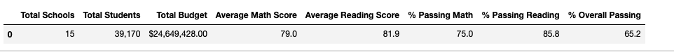
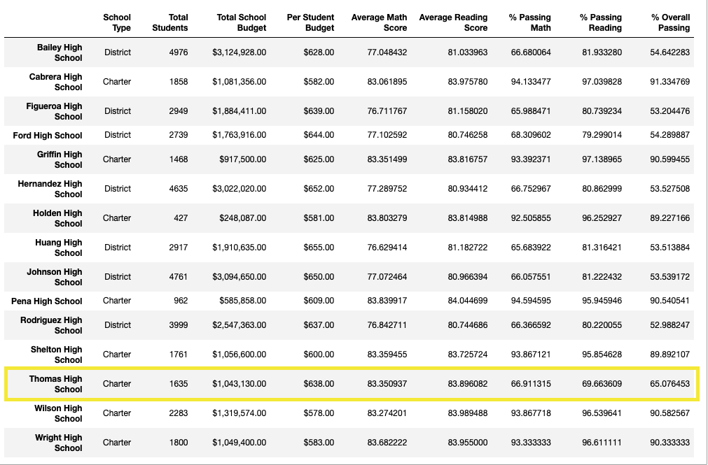

# School_District_Analysis

## Overview

## Analysis

### How is the district summary affected?

The District summary wasn't  much affected. All scores either didn't change or was lower just slightly. 

Before

After

### How does replacing the ninth graders’ math and reading scores affect Thomas High School’s performance relative to the other schools?
Relative to other school the % passing for math and reading have drastically changed. Thomas High School appears that it is performing much better than the other schools and would have a higher rank per say compared to the other schools. Refer to images below. 

Before_

After

### How does replacing the ninth-grade scores affect the following:

Math and reading scores by grade: 
Math and reading scores by grade were not affected. 9th grade scores were a tad higher before.

Scores by school spending:
Scores by school spending did not change.

Scores by school size
Minimal change for scores by school size.

Scores by school type
Minimal change fore scores by school type.
## Summary
Due to the percentage of 9th graders at Thomas High School was minimal compared to the group size, the average scores were not significantly affected. The passing percentages did show some significant change for Thomas High School only. 
